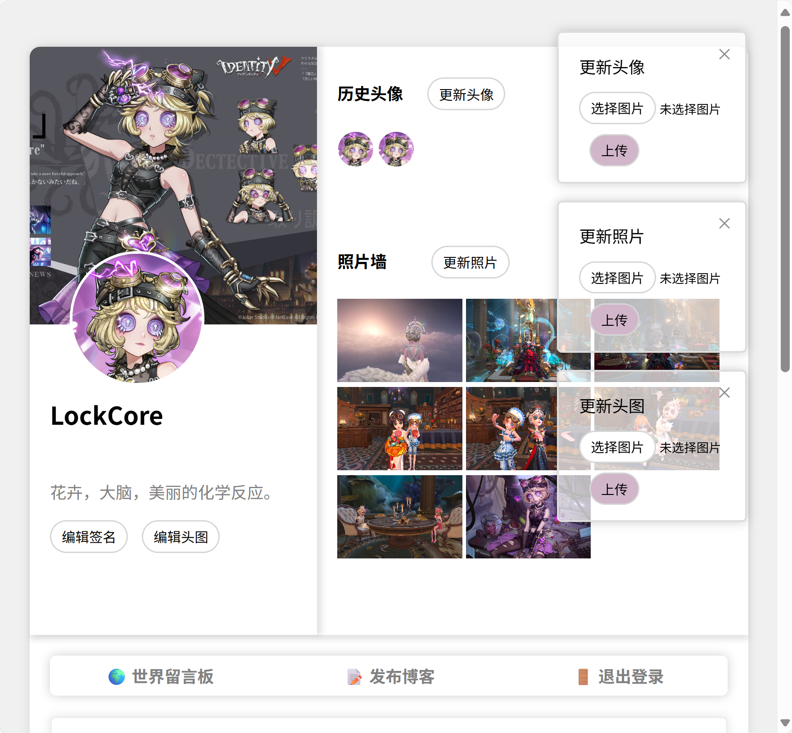
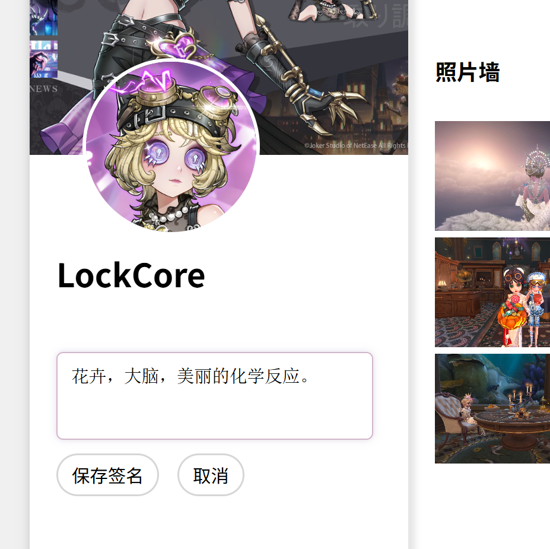
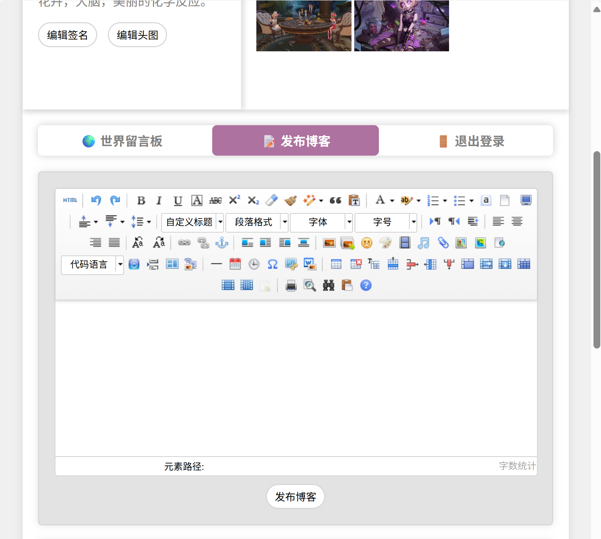
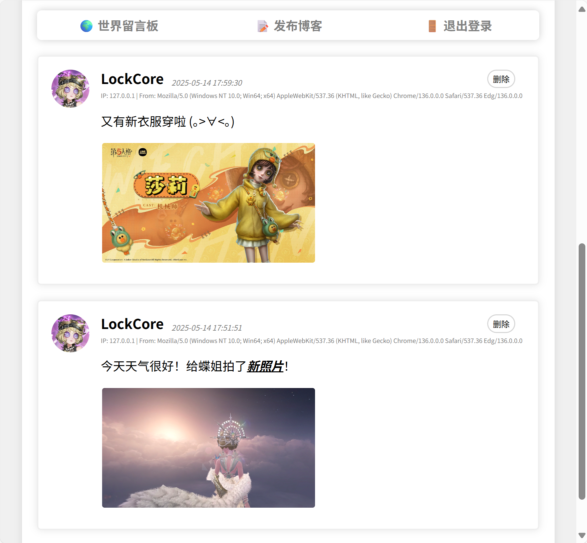
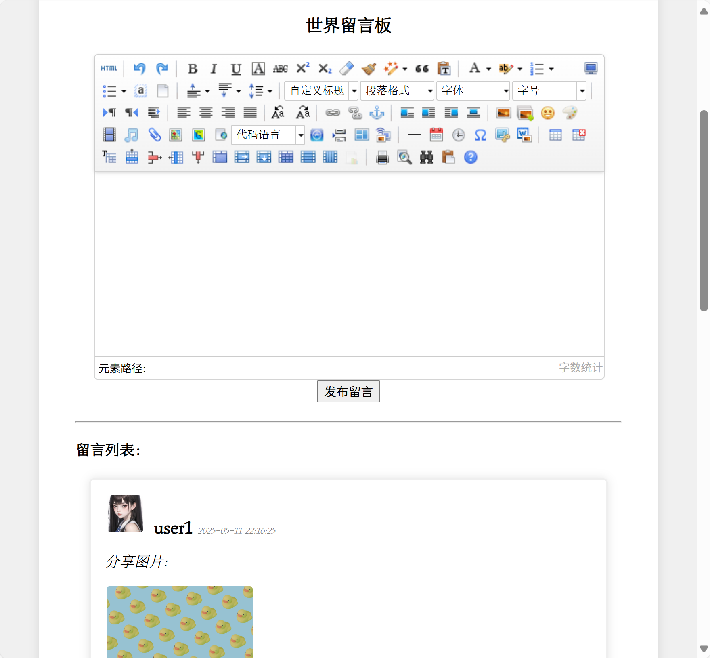
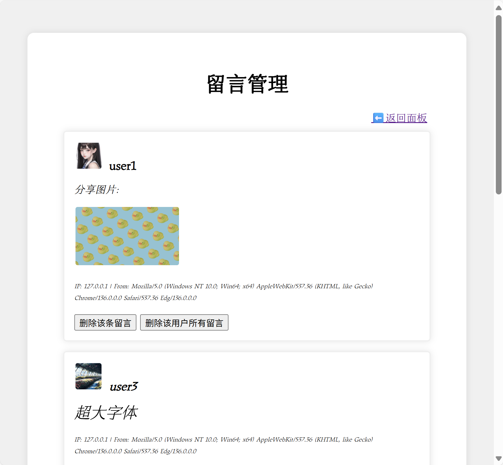
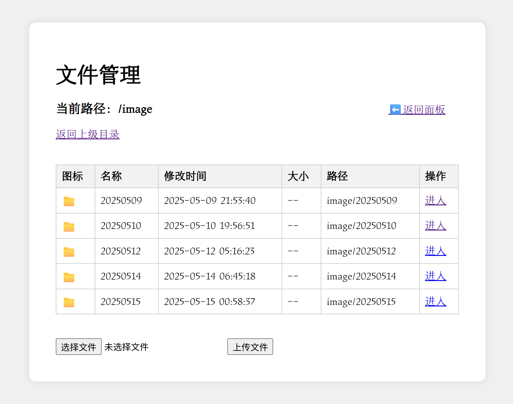

# Full-Stack Blog Project

## Overview

This project is a full-stack blogging platform developed with PHP. Users can register, log in, and manage their blogs.

## Features

- **User Registration and Login**
  - Register a new account.
  - Log in with username and password.

- **Profile Management**
  
  - Change profile picture and decorate photo wall.

    
  
    
  
  - Update personal signature.
  
    
  
- **Blog Management**
  - Publish new blog posts.
  
    
  
  - View and delete existing blog posts.
  
    
  
- **World Message Board**
  
  - Post messages on the board.
  
    
  
- **Admin Features**
  
  - Manage user messages.
  
    
  
  - Manage uploaded files.
  
    

## Tech Stack

- **Frontend**: HTML, CSS, JavaScript
- **Backend**: PHP
- **Database**: MySQL

